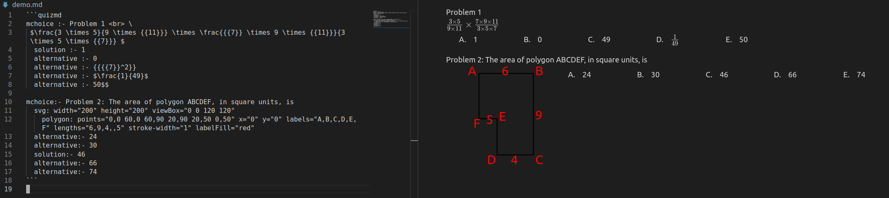

QuizMD is a library for writing quizzes with markdown.



# List of Supported Quiz Elements

## circle

Draw a circle
```
circle: r="3" cx="50" cy="50"

```
## ellipse

Draw an ellipse
```
ellipse: rx="5" ry="10" cx="50" cy="50"

```
## polygon

Draw a polygon
```
polygon: points="0,0 60,0 60,90 20,90 20,50 0,50" x="100" y="100" fill="yellow" stroke-width="1" stoke="blue" nodes="A,B,C,D,E,F" lengths="6,9,4,4,2,5"

```
## polyline

Draw a polyline
```
polyline: points="0,0 60,0 60,90 20,90 20,50 0,50" x="100" y="100" fill="yellow" stroke-width="1" stoke="blue" nodes="A,B,C,D,E,F" lengths="6,9,4,4,2"

```
## rectangle

Draw a rectangle
```
rect: width="100" height="50" x="0" y="0"

```
## rhombus

Draw a rhombus
```
rhombus: p="5" q="10" cx="50" cy="50"

```
## square

Draw a square
```
square: side="100" x="50" y="50"

```
## svg

Draw Scalable Vector Graphics (SVG)
```
svg: width="30" height="40" viewBox="0 0 100 100"

```
## alternative

Create an alternative
```
alternative:- alternative content

```
## solution

Create a solution alternative
```
solution:- solution content

```
## mchoice

Create a multiple-choice question
```
mchoice :- Question content
  alternative:- text
  solution:- text

```
## mmchoice

Create a problem with a few multiple-choice questions
```
mmchoice :- Overall problem statement
  mchoice :- Question statement<br>
    alternative:- text
    solution:- text

```

